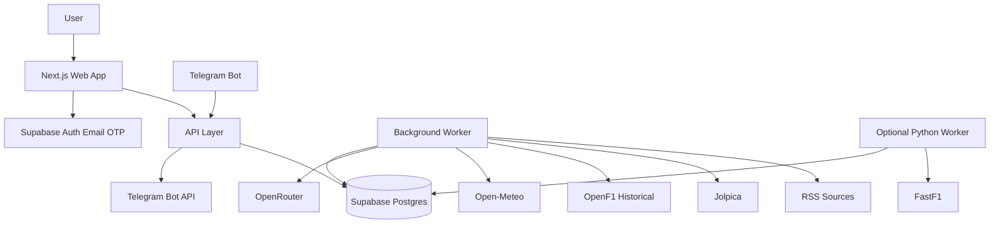

# 03. Architecture

## Рекомендуемый стек

### Frontend

- Next.js App Router.
- TypeScript.
- Tailwind CSS.
- shadcn/ui или аналог.
- Mobile-first.
- PWA-ready.

### Backend

Для MVP можно начать с:
- Next.js API routes/server actions;
- Supabase Auth;
- Supabase Postgres;
- отдельный Node worker для фоновых задач.

Для масштабирования:
- NestJS/Fastify API;
- Redis + BullMQ;
- отдельный worker;
- отдельный Python worker для FastF1.

## Компоненты



## Главный принцип данных

Плохо:

```text
Frontend -> external API
```

Правильно:

```text
Worker -> external API -> DB -> API -> Frontend
```

## Фоновые задачи

- `rss.fetch_all`
- `news.apply_tags`
- `news.ai_summarize`
- `digests.generate_daily`
- `jolpica.sync_calendar`
- `jolpica.sync_results`
- `openf1.sync_historical_session`
- `weather.sync_circuits`
- `predictions.lock`
- `predictions.score`
- `notifications.dispatch`

## API endpoints

### Public

- `GET /api/news`
- `GET /api/news/:id`
- `GET /api/digests/latest`
- `GET /api/calendar`
- `GET /api/races/:raceId`
- `GET /api/standings/drivers`
- `GET /api/standings/constructors`
- `GET /api/drivers`
- `GET /api/drivers/:id`
- `GET /api/teams`
- `GET /api/teams/:id`
- `GET /api/circuits/:id`

### Authenticated

- `GET /api/me`
- `PATCH /api/me`
- `GET /api/me/preferences`
- `PATCH /api/me/preferences`
- `POST /api/telegram/link-token`
- `DELETE /api/telegram/disconnect`
- `POST /api/races/:raceId/prediction`
- `GET /api/races/:raceId/prediction`
- `GET /api/leagues`
- `POST /api/leagues`
- `POST /api/leagues/join`
- `POST /api/polls/:pollId/vote`

### Webhooks

- `POST /api/telegram/webhook`

### Admin

- `GET /api/admin/sources`
- `POST /api/admin/sources`
- `PATCH /api/admin/sources/:id`
- `POST /api/admin/sources/:id/fetch-now`
- `GET /api/admin/jobs`
- `GET /api/admin/news`
- `POST /api/admin/news/:id/reprocess-ai`
- `POST /api/admin/sync/f1`
- `POST /api/admin/digests/generate`
- `GET /api/admin/ai-usage`

## Кеширование

### RSS

- каждые 10–30 минут;
- дедупликация по canonical URL и fuzzy title.

### Jolpica

- календарь daily;
- результаты/standings после сессий;
- backoff при 429.

### OpenF1

- только historical/free;
- не дергать во время live window;
- throttling.

### AI

- генерировать summary один раз на article;
- хранить model/version;
- логировать tokens/cost;
- cost cap через ENV.

### Telegram

- отправка через очередь;
- логирование результата;
- при blocked user отключать Telegram уведомления.
